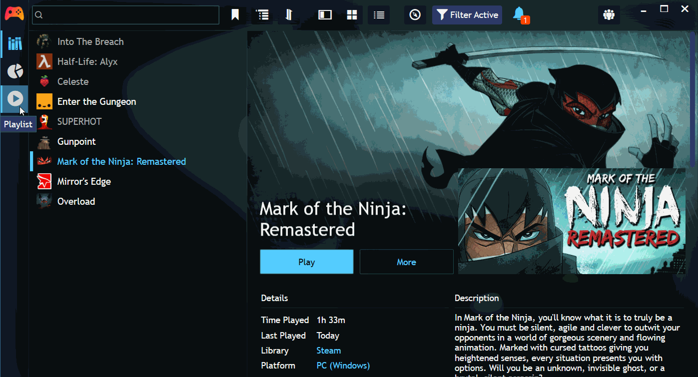

# Playlist extension for [Playnite](https://playnite.link/)

This extension provides a sidebar action with a manually ordered "playlist" queue of games.

Games can be added to the playlist by right clicking them in the library view and selecting "Add to Playlist".

This extension can be used as a simple quick access game list, or you can use it to work through your backlog of games. Move games to the top of the list that you intend to play soon. 

The playlist is accessible from the left sidebar in Playnite. Games can be reordered with drag and drop. Right click to remove games, or move a group of games to the top or the bottom. Games can be launched from the play button in the playlist or by pressing enter on the the keyboard.

This extension requires Playnite 9 or newer.

## External libraries, etc.

* Drag and drop is implemented using [GongSolutions.WPF.DragDrop](https://github.com/punker76/gong-wpf-dragdrop)
* `ui-play` and `play-alt-1` icons are used from [Icofont](https://icofont.com/) (CC BY 4.0)